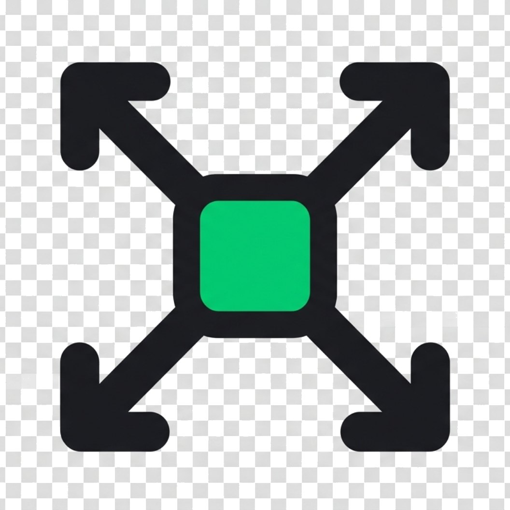

<p align="center">
  
</p>

<h1 align="center">Crossposter</h1>

<p align="center">
  <strong>Private crossposting dashboard for your own social accounts.</strong><br>
  Compose once, attach media, publish now, or schedule posts from a local/self-hosted server.
</p>

<p align="center">
  <a href="#supported-channels">Supported Channels</a>
  · <a href="#run-locally">Run Locally</a>
  · <a href="#provider-setup">Provider Setup</a>
  · <a href="#security">Security</a>
</p>

---

## Overview

Crossposter is a small local/self-hosted publishing dashboard. It is built for
personal use: no database, no queue service, and no multi-user product layer.
Posts can be sent immediately with **Publish now** or saved to the local
scheduler for a later time.

This is intentionally not a Postiz-style stack. Full scheduling products usually
need services such as Postgres, Redis, queues, workers, and separate background
jobs. Crossposter keeps the surface area narrow so it can run on your Mac, a
small VPS, Render, or a simple Node host. Scheduled posts publish only while
that server process is running.

## Supported Channels

| Channel | Current support |
| --- | --- |
| Bluesky | Text posts and local image media |
| Mastodon | Text posts and local media |
| Dev.to | Markdown articles |
| LinkedIn | Personal profile posts and approved Page posts, with optional images or MP4 video |
| Nostr | Kind-1 text notes published to configured relays |
| Hacker News | Personal link/text submission through HN's normal form flow |

Removed integrations: Instagram, Pinterest, Twitch, and YouTube are not part of
the current app.

## Features

- Dashboard composer for title, body text, channel selection, and media upload
- Inline Schedule draft control for local timed posting
- Scheduler page for reviewing queued posts, editing timing, and discarding posts
- Per-platform profile configuration from the UI
- Local config saved to `poster.config.local.json`
- Local publish history
- Local media upload storage in `.poster-uploads`
- Image conversion/compression with quality and target size controls
- Video conversion/compression to MP4 for supported channels
- Platform preflight warnings before publishing
- Light/dark/system theme controls
- macOS auto-start service for `http://localhost:2004`

## Scheduled Posting

Use **Schedule draft** next to **Publish now** on the Dashboard. It opens a
local date/time popup next to the button you clicked, then saves the post to
`poster.config.local.json`.

Manage the queue from:

```text
http://localhost:2004/scheduled
```

The Scheduler page lets you:

- edit the scheduled timing
- discard queued or failed posts
- review target channels, media, and last publish errors

When a scheduled post publishes successfully, it is added to local publish
history and removed from the Scheduler queue.

The scheduler is local/self-hosted. The Crossposter server must be running at
the scheduled time:

- `npm run dev:local` pings the scheduler every 30 seconds
- the macOS auto-start service keeps `http://localhost:2004` alive after login
- on Render or a VPS, keep the Node service running with persistent disk

If the server is offline when a post is due, it will publish the next time the
server starts and the scheduler tick runs.

## Run Locally

```bash
npm install
cp .env.example .env
npm run dev:local
```

Open:

```text
http://localhost:2004
```

That is the default bookmarkable local URL.

### Change The Local Port

Set `POSTER_LOCAL_PORT` in Settings or `poster.config.local.json`, then restart
the local service.

```bash
POSTER_LOCAL_PORT=2080 npm run dev:local
```

### macOS Auto-Start

Install the launchd service:

```bash
npm run local:install
```

You can also control it from:

```text
Settings > Local Settings > Auto-start
```

Turn on **Always restart localhost** and macOS will keep
`http://localhost:2004` available after login/restart.

Use a custom port once:

```bash
./scripts/install-local-service.sh 2080
```

Remove the service:

```bash
npm run local:uninstall
```

## Configuration

The app reads configuration from:

1. `poster.config.local.json`
2. environment variables
3. defaults in the code

`poster.config.local.json` is gitignored. It is the preferred place for local
tokens and profile settings because it is managed by the Settings UI.

For public/self-hosted deployments, set:

```text
POSTER_REQUIRE_ADMIN_PASSWORD=true
POSTER_ADMIN_PASSWORD=strong-password-here
```

## Provider Setup

### Bluesky

Create a Bluesky app password. Do not use your main account password.

Required fields:

```text
BLUESKY_IDENTIFIER
BLUESKY_APP_PASSWORD
```

`BLUESKY_IDENTIFIER` should be your handle without `@`, for example:

```text
name.bsky.social
```

### Mastodon

Create an application/access token from your Mastodon instance settings.

Required fields:

```text
MASTODON_INSTANCE
MASTODON_ACCESS_TOKEN
```

Example instance:

```text
https://mastodon.social
```

### Dev.to

Create an API key from Dev.to account settings.

Required field:

```text
DEVTO_API_KEY
```

Dev.to publishing expects a title and Markdown body text.

### Nostr

Nostr publishes signed kind-1 text notes directly to relay WebSocket URLs.

Required fields:

```text
NOSTR_PRIVATE_KEY
NOSTR_RELAYS
```

`NOSTR_PRIVATE_KEY` can be an `nsec...` key or a 64-character hex private key.
Use a dedicated Nostr key if you do not want Crossposter to sign as your main
identity.

`NOSTR_RELAYS` is a comma or newline separated list of relays:

```text
wss://relay.example.com,wss://another-relay.example
```

Local media is ignored for Nostr. Paste public image/video links into the post
body if you want Nostr clients to render media previews.

### Hacker News

Hacker News has no official write/submit API. Crossposter uses unofficial
personal automation through Hacker News' normal login and submit form flow.

Required fields:

```text
HACKERNEWS_USERNAME
HACKERNEWS_PASSWORD
```

How publishing works:

- Title is required.
- If the post body contains an `http` or `https` URL, the first URL is submitted
  as a link story.
- If the post body has no URL, the post body is submitted as a text story.
- Local media is ignored.
- Crossposter logs in during publish and does not store an HN session cookie.

Use this only for your own Hacker News account and normal personal submissions.
Do not use it for spam, vote/comment solicitation, or bulk promotional posting.
If Hacker News requires browser validation or CAPTCHA for the login, Crossposter
will fail and you must submit manually.

### LinkedIn

LinkedIn can be connected from the local Settings page after creating a LinkedIn
developer app.

Add this callback URL in the LinkedIn app Auth tab:

```text
http://localhost:2004/api/auth/linkedin/callback
```

For personal profile posting:

1. Enable **Share on LinkedIn**.
2. Enable **Sign In with LinkedIn using OpenID Connect**.
3. Use scopes:

```text
openid profile w_member_social
```

4. Add the LinkedIn client ID and secret in Crossposter.
5. Click **Connect LinkedIn** from Settings.

The local callback saves `LINKEDIN_ACCESS_TOKEN` and a personal
`LINKEDIN_AUTHOR_URN` automatically.

For LinkedIn Page posting:

1. Create or choose the LinkedIn Page that owns the developer app.
2. Make sure the signed-in member is an admin or content admin for that Page.
3. Make sure the LinkedIn app has access to `w_organization_social`.
4. Use scopes:

```text
openid profile w_member_social w_organization_social
```

5. Click **Connect LinkedIn**.
6. Replace `LINKEDIN_AUTHOR_URN` with the Page author:

```text
urn:li:organization:YOUR_PAGE_ORG_ID
```

Valid author examples:

```text
urn:li:person:YOUR_PERSON_ID
urn:li:organization:YOUR_PAGE_ORG_ID
```

`LINKEDIN_VERSION` defaults to `202605`.

LinkedIn local media upload supports JPG, PNG, and GIF images, plus MP4 videos
between 75 KB and 500 MB. Unsupported local media is rejected before publishing.

## Local Media Conversion

The composer can convert and compress media before publishing:

- images are converted to JPG output with quality, target size, and estimated size
- videos are transcoded to MP4 with quality and target size controls
- platform warnings offer conversion only when conversion can fix a selected
  channel's media problem

## Static Web Page

The `web/` folder contains a small static page for app review, privacy, and
terms references. It is intended for a domain such as:

```text
crossposter.apoorvdarshan.com
```

Files:

```text
web/index.html
web/assets/logo-crossposter.png
PRIVACY.md
TERMS.md
```

## Deploy

### Vercel

```bash
npm install
vercel
```

Set environment variables in Vercel Project Settings. At minimum:

```text
POSTER_ADMIN_PASSWORD
POSTER_REQUIRE_ADMIN_PASSWORD=true
```

Then add provider credentials only for the channels you want to use.

### Render Or VPS

Render or a self-hosted Node server can run the same app. Persistent disk is
recommended if you want uploaded media and local publish history to survive
restarts.

## Security

Crossposter is private by convention, not a full multi-user auth system.

For local-only use:

```text
POSTER_REQUIRE_ADMIN_PASSWORD=false
```

Before exposing it publicly:

- set `POSTER_REQUIRE_ADMIN_PASSWORD=true`
- use a strong `POSTER_ADMIN_PASSWORD`
- keep `poster.config.local.json` private
- never commit API keys, access tokens, refresh tokens, or app secrets
- only connect accounts, pages, and profiles you own or are authorized to manage

## Contact And Support

- Email: apoorvdarshan@gmail.com
- Email: ad13dtu@gmail.com
- X: https://x.com/apoorvdarshan
- Report an issue: https://github.com/apoorvdarshan/crossposter/issues/new
- Request a feature: https://github.com/apoorvdarshan/crossposter/issues/new
- View open issues: https://github.com/apoorvdarshan/crossposter/issues

Do not post API keys, tokens, app secrets, or private account details in public
issues.

## License

MIT
